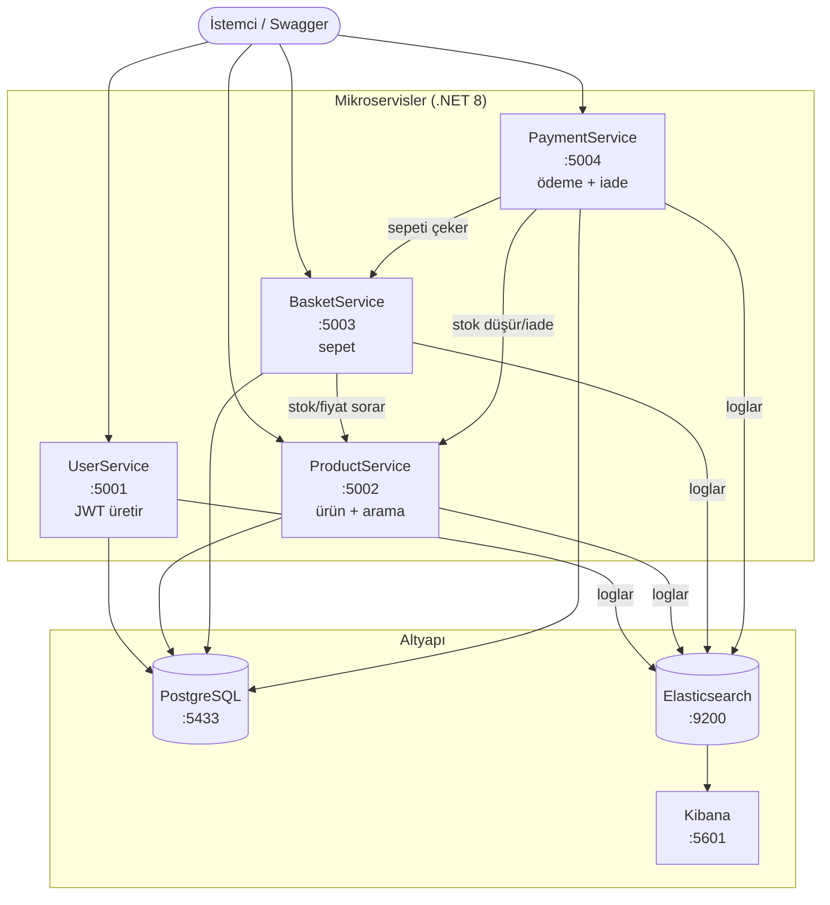

# HepsiClone — .NET Microservices E-Commerce Backend


E-ticaret senaryosunu (kullanıcı → ürün → sepet → ödeme → iade) modelleyen, **4 bağımsız mikroservisten** oluşan bir .NET 8 backend'i. JWT authentication, servisler arası HTTP iletişimi, Elasticsearch ile fuzzy arama, correlation ID'li merkezî loglama ve tek komutla Docker kalkışı içerir.

---

## 🏗️ Mimari



**Akış:** Kullanıcı `UserService`'ten JWT alır → `ProductService`'te ürünlere bakar/arar → `BasketService` ile sepete ekler (BasketService, ProductService'e stok/fiyat sorar) → `PaymentService` checkout'ta sepeti BasketService'ten çeker, ödemeyi işler, ProductService'te stoğu düşürür. İade akışında stok telafi (compensating transaction) ile geri eklenir.

---

## 🧰 Teknoloji

| Alan | Teknoloji |
|------|-----------|
| Framework | .NET 8, ASP.NET Core Web API |
| Veritabanı | PostgreSQL + Entity Framework Core (Code-First migrations) |
| Kimlik | JWT Bearer authentication, BCrypt parola hash'leme |
| Arama | Elasticsearch (fuzzy / typo-tolerant search) |
| Loglama | Serilog → Elasticsearch, correlation ID'li istek takibi, Kibana |
| Test | xUnit, Moq, EF Core InMemory |
| CI/CD | GitHub Actions (otomatik build + test) |
| Konteyner | Docker & Docker Compose |

---

## ✨ Özellikler

- **4 bağımsız mikroservis** — her biri kendi veritabanı ve sorumluluğuyla.
- **JWT authentication & authorization** — UserService token üretir, diğer servisler doğrular. ProductService'te okuma serbest, yazma korumalı.
- **Servisler arası iletişim** — `IHttpClientFactory` ile tip-güvenli named client'lar, timeout ve hata toleransı (servis çökerse `503`).
- **Birikimli stok kontrolü** — sepetteki mevcut adet + yeni istek birlikte kontrol edilir.
- **Fuzzy arama** — Elasticsearch üzerinden yazım hatasına toleranslı ürün araması.
- **İade akışı** — kullanıcı talep açar, admin onaylar/reddeder; onayda stok geri eklenir (compensating transaction).
- **Merkezî loglama** — tüm servisler tek Elasticsearch'e loglar, correlation ID ile bir istek servisler boyunca izlenebilir; Kibana'da görselleştirilir.
- **Unit testler** — BasketService (6) + PaymentService (12) = **18 test**.
- **CI pipeline** — her push'ta otomatik build + test.

---

## 🚀 Hızlı Başlangıç (tek komut)

Docker ve Docker Compose kurulu olması yeterli:

```bash
git clone https://github.com/ardadefcoder/hepsiclone-microservices.git
cd hepsiclone-microservices
docker compose up --build
```

İlk açılışta servisler kendi veritabanlarını otomatik oluşturur ve EF migration'larını uygular. Ardından:

| Servis | Swagger |
|--------|---------|
| UserService | http://localhost:5001/swagger |
| ProductService | http://localhost:5002/swagger |
| BasketService | http://localhost:5003/swagger |
| PaymentService | http://localhost:5004/swagger |
| Kibana (loglar) | http://localhost:5601 |

Kapatmak için: `docker compose down` (verileri de silmek için `docker compose down -v`).

---

## 🔐 Auth akışını deneme

1. **UserService** → `POST /api/Auth/register` ile kayıt ol, sonra `POST /api/Auth/login` ile JWT al.
2. Token'ı kopyala.
3. Korumalı bir endpoint'i test etmek için (örn. ProductService `POST /api/Products`), Swagger'daki **Authorize** butonuna tıkla, token'ı yapıştır.
4. Artık korumalı endpoint'lere istek atabilirsin.

---

## 🧪 Testler

```bash
dotnet test
```

- `BasketService.Tests` — sepete ekleme, stok kontrolü, birikimli stok, aynı ürün adet artışı, ürün yok, servis çökmesi.
- `PaymentService.Tests` — iade talebi (yetki/durum kontrolleri), iade onay/ret, stok telafisi, checkout hata senaryoları.

Testler EF Core InMemory ve Moq'lanmış HTTP client'ları kullanır; harici bağımlılık (DB/servis) gerektirmez.

---

## 💻 Lokal Geliştirme (Docker'sız)

Sadece altyapıyı Docker'da, servisleri Visual Studio / `dotnet run` ile çalıştırmak için:

```bash
docker compose up postgres elasticsearch kibana
```

Servisler `appsettings.json`'daki `localhost` bağlantılarını kullanır. (Docker'daki tam kalkışta bu değerler ortam değişkenleriyle otomatik override edilir; `RunMigrations` yalnızca container'da açıktır, lokal geliştirmeyi etkilemez.)

---

## 📁 Proje Yapısı

```
hepsiclone-microservices/
├── UserService.Api/         # kimlik + JWT üretimi
├── ProductService.Api/      # ürün CRUD + Elasticsearch arama
├── BasketService.Api/       # sepet yönetimi
├── PaymentService.Api/      # ödeme + iade
├── BasketService.Tests/     # xUnit + Moq
├── PaymentService.Tests/    # xUnit + Moq
├── .github/workflows/ci.yml # CI pipeline
└── docker-compose.yml       # tüm stack
```

---

## 📝 Lisans

MIT
